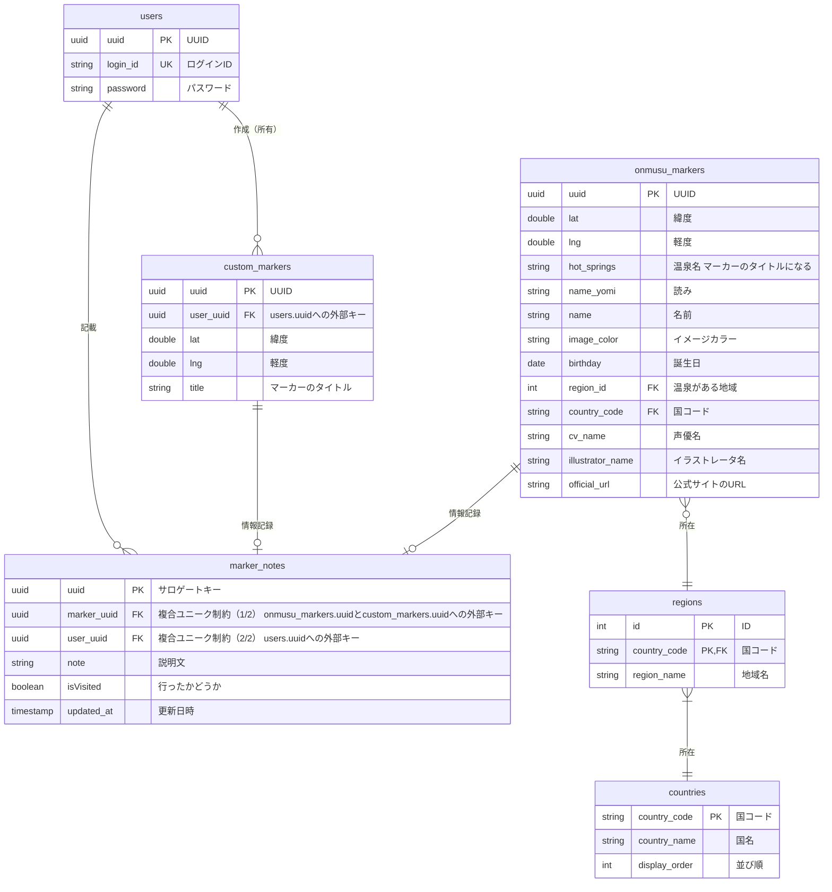

DBは複数ログインに対応できるような設計にするが、一旦はログイン機能なしで単一ユーザを想定して設計・作成

使用したい用途を考えると複数ユーザでログインする必要はないため、ユーザの管理機能は本来用途を達成してから

# 温泉むすめガイドライン
https://onsen-musume.jp/news/5082

# TODO
- [ ] DBのonmusu_markersにデータを入れる
- [ ] 地図に温泉むすめマーカーを表示する
- [ ] マーカーに行ったかどうかのチェックをつける
- [ ] 温泉むすめのマーカーに情報を追加する
- [ ] 温泉娘のマーカーからgooglemapの地図に飛ぶ機能をつける

# 実装予定機能
| 機能名                       | 優先度 | 備考        |
|---------------------------|-----|-----------|
| 温泉むすめの温泉地マーカーを表示          | 高   |           |
| マーカークリックでgooglemapの地点に飛ばす | 高   |           | 
| クリックでマーカーの情報を表示           | 高   |           |
| マーカーに行ったかどうかのチェックをつける     | 高   |           |
| マーカーをgooglemapの地点情報から作成する | 中   |           |
| ログイン機能                    | 低   | アクセス統制＋勉強のため |

# 公開のための構築予定のインフラ図

# DB 

